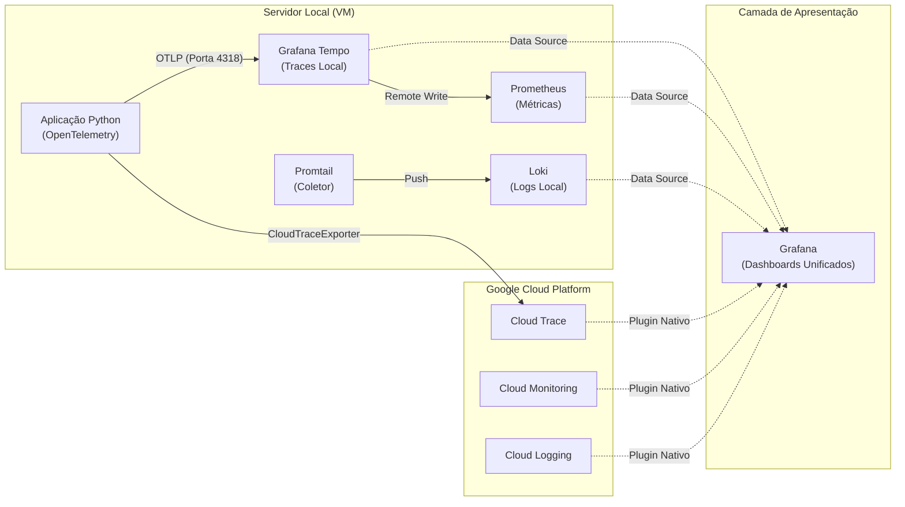

# ☁️ Módulo 3: Integração Grafana com GCP

**Duração:** 03:00h | **Instrutor:** Felipe | **Nível:** Avançado

### 📚 Conteúdo Programático
*   Google Cloud Trace
*   Overview do Grafana
*   Grafana + Google Cloud Trace
*   Grafana + Google Cloud Monitoring
*   Grafana + Google Cloud Logging
*   Laboratório Prático (OpenTelemetry, Dual-Exporting, Tempo, Prometheus, Loki e Promtail)

---

Este repositório contém o guia prático para unificar a observabilidade do Google Cloud (Métricas, Logs e Traces) utilizando o **Grafana** como camada de visualização central. O laboratório aborda um cenário híbrido avançado, coletando dados localmente e enviando redundâncias para a nuvem.

---

## 🏗️ Arquitetura da Solução

Neste laboratório, implementamos uma **Observabilidade Híbrida (Dual-Exporting)**. A aplicação instrumentada com OpenTelemetry envia traces simultaneamente para o Grafana Tempo (armazenamento local) e para o Google Cloud Trace. O Tempo gera métricas (RED metrics) que são armazenadas no Prometheus. Além disso, o Promtail coleta logs de diversos serviços e envia para o Loki. O Grafana centraliza todas essas fontes.



---

## 🛠️ Laboratório Principal: OpenTelemetry + Google Cloud Trace

Este é o guia rápido de execução do laboratório de rastreamento distribuído (Distributed Tracing).

### 1. Configurar o Projeto e Habilitar API
No seu Cloud Shell ou terminal autenticado, defina seu projeto e habilite a API do Cloud Trace:

```bash
export PROJECT_ID="SEU-PROJETO"

gcloud services enable cloudtrace.googleapis.com --project=$PROJECT_ID
```

### 2. Instalar Dependências Python
Instale os pacotes base do OpenTelemetry e os conectores oficiais do Google Cloud:

```bash
pip3 install opentelemetry-api opentelemetry-sdk opentelemetry-exporter-cloud-trace opentelemetry-exporter-otlp --break-system-packages

python3.11 -m pip install --upgrade google-cloud-trace protobuf opentelemetry-exporter-gcp-trace --break-system-packages
```

### 3. Criar o Script da Aplicação (`trace_demo.py`)
Crie o arquivo de simulação:

```bash
nano trace_demo.py
```

Copie o bloco de código abaixo e cole dentro do editor. Este script simula um sistema de transferências bancárias com injeção de latência e validação de antifraude.

```python
import time, random
from opentelemetry import trace
from opentelemetry.sdk.trace import TracerProvider
from opentelemetry.sdk.trace.export import BatchSpanProcessor
from opentelemetry.exporter.cloud_trace import CloudTraceSpanExporter
from opentelemetry.sdk.resources import Resource, SERVICE_NAME, SERVICE_VERSION
from opentelemetry.trace.status import Status, StatusCode

# 1. Configurar Provider e Exporter
resource = Resource.create({
    SERVICE_NAME: "brb-transferencias",
    SERVICE_VERSION: "2.4.1"
})

exporter = CloudTraceSpanExporter(project_id="twitter-clone-sre")
provider = TracerProvider(resource=resource)
provider.add_span_processor(BatchSpanProcessor(exporter))
trace.set_tracer_provider(provider)
tracer = trace.get_tracer("brb.monitoramento")

# 2. Funções Simuladas
def consultar_saldo(conta_id: str) -> float:
    with tracer.start_as_current_span("db.consultar_saldo") as span:
        span.set_attribute("db.system", "postgresql")
        time.sleep(random.uniform(0.015, 0.06))
        span.set_status(Status(StatusCode.OK))
        return random.uniform(500.0, 80000.0)

def verificar_antifraude(valor: float) -> bool:
    with tracer.start_as_current_span("fraude.verificar") as span:
        span.set_attribute("fraude.motor", "scoring-v3")
        time.sleep(random.uniform(0.08, 0.35)) 
        aprovado = random.uniform(0.0, 1.0) < 0.85
        span.set_status(Status(StatusCode.OK))
        return aprovado

def processar_transferencia(de_conta: str, para_conta: str, valor: float):
    with tracer.start_as_current_span("transferencia.processar") as span:
        try:
            saldo = consultar_saldo(de_conta)
            if valor > saldo:
                raise ValueError("Saldo insuficiente")

            if not verificar_antifraude(valor):
                raise ValueError("Bloqueado pelo antifraude")

            time.sleep(random.uniform(0.02, 0.08))
            span.set_status(Status(StatusCode.OK))
            print(f"  ✅ PIX R$ {valor:.2f} de {de_conta} → {para_conta}")

        except ValueError as e:
            span.record_exception(e)
            span.set_status(Status(StatusCode.ERROR, str(e)))
            raise e  

# 3. Execução
print("🚀 Enviando Traces...")
for i in range(8):
    try:
        processar_transferencia(f"BRB-{1000+i}", f"BRB-{2000+i}", random.uniform(50, 15000))
    except ValueError as e:
        print(f"  ❌ Falha: {e}")
    time.sleep(0.5)

time.sleep(6)
print("✅ Concluído!")
```

### 4. Executar e Visualizar
Rode o script para gerar os traces e enviá-los para a nuvem:

```bash
python3.11 trace_demo.py
```

**Resultado:** Acesse [console.cloud.google.com/traces](https://console.cloud.google.com/traces) no seu navegador para ver os gráficos de cascata (waterfall) gerados, detalhando a latência de cada etapa da transferência.

---

## ⚙️ Configuração Híbrida Adicional (Grafana, Prometheus, Tempo e Loki)

Para completar a arquitetura de **Dual-Exporting** e visualizar tudo no Grafana localmente, siga os passos abaixo para configurar os backends auxiliares.

### 1. Preparação do Grafana (Plugin GCP)
Para que o Grafana consulte o Google Cloud nativamente:
```bash
grafana-cli plugins install grafana-googlecloud-datasource
sudo systemctl restart grafana-server
```
*No Grafana UI, vá em Connections -> Data Sources -> Add data source -> Google Cloud Monitoring/Logging/Trace e autentique com o JSON da sua Service Account.*

### 2. Configurando o Backend de Métricas (Prometheus)
```bash
cd ~
wget https://github.com/prometheus/prometheus/releases/download/v2.54.1/prometheus-2.54.1.linux-amd64.tar.gz
tar -xzf prometheus-2.54.1.linux-amd64.tar.gz
sudo mv prometheus-2.54.1.linux-amd64/prometheus /usr/local/bin/
sudo mkdir -p /etc/prometheus /var/lib/prometheus
sudo mv prometheus-2.54.1.linux-amd64/prometheus.yml /etc/prometheus/

sudo bash -c 'cat <<EOF > /etc/systemd/system/prometheus.service
[Unit]
Description=Prometheus
After=network.target

[Service]
Type=simple
User=root
ExecStart=/usr/local/bin/prometheus --config.file=/etc/prometheus/prometheus.yml --storage.tsdb.path=/var/lib/prometheus --web.enable-remote-write-receiver
Restart=on-failure

[Install]
WantedBy=multi-user.target
EOF'

sudo systemctl daemon-reload && sudo systemctl enable --now prometheus
```

### 3. Configurando o Backend de Traces (Grafana Tempo)
```bash
cd ~
wget https://github.com/grafana/tempo/releases/download/v3.0.3/tempo_3.0.3_linux_amd64.tar.gz
tar -xzf tempo_3.0.3_linux_amd64.tar.gz
sudo mv tempo /usr/local/bin/
sudo mkdir -p /etc/tempo /var/lib/tempo /var/lib/tempo/generator/wal

sudo bash -c 'cat <<EOF > /etc/tempo/tempo.yaml
server:
  http_listen_port: 3200
distributor:
  receivers:
    otlp:
      protocols:
        http:
          endpoint: 0.0.0.0:4318
        grpc:
          endpoint: 0.0.0.0:4317
storage:
  trace:
    backend: local
    local:
      path: /var/lib/tempo/blocks
    wal:
      path: /var/lib/tempo/wal
overrides:
  defaults:
    metrics_generator:
      processors: [span-metrics, service-graphs]
    metrics_generator:
  registry:
    external_labels:
      source: tempo
  storage:
    path: /var/lib/tempo/generator/wal
  remote_write:
    - url: http://localhost:9090/api/v1/write
EOF'

sudo bash -c 'cat <<EOF > /etc/systemd/system/tempo.service
[Unit]
Description=Grafana Tempo
After=network.target

[Service]
Type=simple
User=root
ExecStart=/usr/local/bin/tempo -config.file=/etc/tempo/tempo.yaml
Restart=on-failure

[Install]
WantedBy=multi-user.target
EOF'

sudo systemctl daemon-reload && sudo systemctl enable --now tempo
```

### 4. Centralização de Logs (Promtail + Loki)
```bash
wget https://github.com/grafana/loki/releases/download/v2.9.2/promtail-linux-amd64.zip
unzip promtail-linux-amd64.zip
chmod +x promtail-linux-amd64

cat <<'EOF' > promtail-local.yaml
server:
  http_listen_port: 9080
  grpc_listen_port: 0

clients:
  - url: http://localhost:3100/loki/api/v1/push

scrape_configs:
- job_name: logs_do_sistema
  static_configs:
  - targets:
      - localhost
    labels:
      job: syslog
      __path__: /var/log/syslog
EOF

sudo nohup ./promtail-linux-amd64 -config.file=promtail-local.yaml > promtail.log 2>&1 &
```

---

## 📊 Visualização Avançada no Grafana

Com os Data Sources configurados (Prometheus, Tempo, Loki e Google Cloud Data Sources), você poderá criar:

1. **Traces Drilldown:** Configure o Tempo no Grafana apontando o *Trace to metrics* para o Prometheus. Isso permite ver gráficos de RED (Rate, Errors, Duration) e pular diretamente para os traces (Waterfall) mais lentos.
2. **Cloud Monitoring via MQL:** Use a linguagem do GCP para criar métricas agregadas complexas, por exemplo:
   ```text
   fetch consumed_api
   | metric "run.googleapis.com/request_latencies"
   | filter resource.service_name = "meu-servico"
   | align delta(1m)
   | every 1m
   | group_by [], [value_request_latencies_percentile: percentile(value.request_latencies, 99)]
   ```
3. **Correlação Logs -> Traces:** Configure *Derived Fields* no Data Source do Cloud Logging ou Loki para buscar o padrão de um *Trace ID* nos logs e transformá-lo num link clicável que abre automaticamente o painel de Trace (Cloud Trace ou Tempo).
